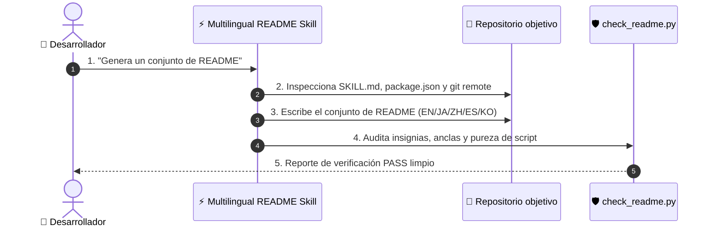

# ⚡ Multilingual README

[](https://opensource.org/licenses/MIT)
[](https://claude.com/claude-code)
[](https://www.python.org/)

[English](README.md) · [日本語](README.ja.md) · [简体中文](README.zh-CN.md) · **Español** · [한국어](README.ko.md)

> **Genera un conjunto de README en 5 idiomas listo para producción en segundos — verificado por análisis de pureza de script.**

---

## 🔰 ¿Qué es esto?

Imagina un equipo de relaciones públicas internacional automatizado para tu código. Cuando un desarrollador llega a tu repositorio de GitHub, tienes unos 10 segundos para mostrarle qué hace tu herramienta y cómo instalarla. Este skill inspecciona los archivos de tu proyecto, escribe READMEs de aspecto nativo en cinco idiomas y verifica mecánicamente que ninguna orden de instalación sea falsa.

---

## 📐 Arquitectura



---

## ✨ 3 puntos clave

### ⚡ Guías de instalación sin alucinaciones
Obtiene las rutas de instalación reales directamente de los archivos fuente en lugar de inventar comandos defectuosos.

### 🌐 Transcreación de nivel nativo
Reescribe los conceptos principales para desarrolladores de habla hispana, japonesa, china y coreana sin recurrir a traducciones literales.

### 🛡️ Verificación de pureza automatizada
Incluye un script de verificación en Python que valida la estructura, los enlaces y evita la filtración de caracteres extraños.

---

## 🔄 Antes / Después

| Métrica / Aspecto | Antes | Después |
|---|---|---|
| Tiempo de creación | Más de 2 horas por idioma | ~10 segundos para 5 idiomas |
| Comandos de instalación | A menudo rotos o inventados | 100% extraídos de archivos fuente |
| Calidad de localización | Traducción automática rígida | Terminología nativa para desarrolladores |
| Verificación | Revisión manual rápida | Auditoría automatizada con `check_readme.py` |

---

## 🚀 Instalación y uso

### 🖥️ Claude Code (CLI)

Clona directamente en tu directorio personal de skills:

```bash
git clone https://github.com/takaoumehara/multilingual-readme.git ~/.claude/skills/multilingual-readme
```

Invócalo en cualquier sesión:

```
/multilingual-readme
```

### 🧩 Cursor / AI IDE

Copia en el directorio local de skills de tu proyecto o añade las instrucciones en `AGENTS.md`:

```bash
git clone https://github.com/takaoumehara/multilingual-readme.git .claude/skills/multilingual-readme
```

### 🛠️ Desde el código fuente

Clona y ejecuta el verificador localmente:

```bash
git clone https://github.com/takaoumehara/multilingual-readme.git
cd multilingual-readme
python3 scripts/check_readme.py . --langs en,ja,zh-CN,es,ko
```

---

## 📄 Licencia

MIT
