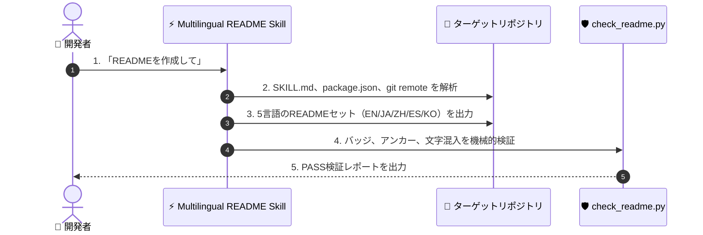

# ⚡ Multilingual README

[](https://opensource.org/licenses/MIT)
[](https://claude.com/claude-code)
[](https://www.python.org/)

[English](README.md) · **日本語** · [简体中文](README.zh-CN.md) · [Español](README.es.md) · [한국어](README.ko.md)

> **プロダクション品質の5言語READMEセットを数秒で作成 — スクリプトによる自動検証付き。**

---

## 🔰 これは何？

コードの魅力を世界に伝える自動広報チームのようなツールです。開発者がGitHubリポジトリに訪問した際、ファーストビューの約10秒間でツールの概要とインストール方法を伝える必要があります。このスキルはプロジェクト構成ファイルを自動解析し、各言語のネイティブ開発者にとって自然な5言語のREADMEを生成するとともに、存在しないコマンドや誤った翻訳が含まれていないかをスクリプトで機械的に検証します。

---

## 📐 システム概念図



---

## ✨ 3つの強み

### ⚡ 実ファイルに基づく正確なインストール手順
プロジェクト内の実際のファイル構造からインストールパスやエントリーポイントを特定し、動かない架空のコマンド出力を防止します。

### 🌐 ネイティブ品質のトランスクリエーション
単なる直訳ではなく、各言語の開発者が実際に使うテクニカル用語を用いて、自然で読みやすいドキュメントを再構築します。

### 🛡️ 自動検証スクリプトによる品質担保
付属のPython検証スクリプトが見出し構造、相互リンク、セクション数、他言語文字の漏れを機械的にテストします。

---

## 🔄 導入前 / 導入後

| 項目 | 導入前 | 導入後 |
|---|---|---|
| ドキュメント作成時間 | 1言語あたり2時間以上 | 5言語セットを約10秒で生成 |
| インストール手順 | コマンドの打ち間違いや動かない手順が発生 | ソースコードから100%自動抽出し正確 |
| 翻訳品質 | 機械翻訳による違和感のある文章 | ネイティブ開発者向けの自然な表現 |
| 検証作業 | 手動での目視チェック | `check_readme.py` による自動テスト |

---

## 🚀 インストールと使い方

### 🖥️ Claude Code (CLI)

個人のスキルフォルダに直接クローンします:

```bash
git clone https://github.com/takaoumehara/multilingual-readme.git ~/.claude/skills/multilingual-readme
```

セッション内で呼び出します:

```
/multilingual-readme
```

### 🧩 Cursor / AI IDE

プロジェクトのローカルスキルフォルダに配置するか、`AGENTS.md` に指示を追加します:

```bash
git clone https://github.com/takaoumehara/multilingual-readme.git .claude/skills/multilingual-readme
```

### 🛠️ ソースから実行

リポジトリをクローンし、検証スクリプトを実行します:

```bash
git clone https://github.com/takaoumehara/multilingual-readme.git
cd multilingual-readme
python3 scripts/check_readme.py . --langs en,ja,zh-CN,es,ko
```

---

## 📄 ライセンス

MIT
