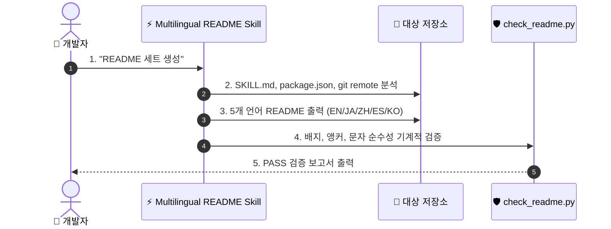

# ⚡ Multilingual README

[](https://opensource.org/licenses/MIT)
[](https://claude.com/claude-code)
[](https://www.python.org/)

[English](README.md) · [日本語](README.ja.md) · [简体中文](README.zh-CN.md) · [Español](README.es.md) · **한국어**

> **프로덕션 품질의 5개 언어 README 세트를 수초 만에 생성 — 자동 검증 스크립트 포함.**

---

## 🔰 이게 뭔가요?

코드의 가치를 전 세계에 전달하는 자동화된 홍보 팀과 같습니다. 개발자가 GitHub 저장소에 방문했을 때 약 10초 내에 도구의 기능과 설치 방법을 파악할 수 있어야 합니다. 이 스킬은 프로젝트 소스 파일을 분석하여 5개 언어로 자연스러운 README를 작성하고, 작동하지 않는 명령어나 언어 교차 오염이 없는지 스크립트로 엄격하게 검증합니다.

---

## 📐 시스템 구조



---

## ✨ 3가지 강점

### ⚡ 실제 파일 기반의 정확한 설치 가이드
프로젝트 소스 파일에서 실제 설치 경로와 진입점을 추출하여 실행 불가능한 허위 명령어가 생성되는 것을 방지합니다.

### 🌐 현지 개발자 맞춤 트랜스크리에이션
단순 직역이 아닌 각 언어권 개발자가 실제로 사용하는 기술 용어와 어조로 자연스럽게 재작성합니다.

### 🛡️ 자동화된 순수성 검증 스크립트
기본 제공되는 Python 검증 스크립트가 헤더 구조, 링크, 섹션 수, 타 언어 문자 유출을 기계적으로 테스트합니다.

---

## 🔄 도입 전 / 도입 후

| 항목 | 도입 전 | 도입 후 |
|---|---|---|
| 작성 소요 시간 | 언어당 2시간 이상 | 5개 언어 세트 약 10초 만에 생성 |
| 설치 명령어 | 자주 오타가 나거나 작동하지 않음 | 소스 파일에서 100% 자동 추출하여 정확함 |
| 번역 품질 | 어색한 기계 번역 | 현지 개발자 수준의 자연스러운 용어 |
| 검증 방식 | 수동 눈가늠 검수 | `check_readme.py`를 통한 자동화 검사 |

---

## 🚀 설치 및 사용법

### 🖥️ Claude Code (CLI)

개인 스킬 디렉터리에 직접 복사합니다:

```bash
git clone https://github.com/takaoumehara/multilingual-readme.git ~/.claude/skills/multilingual-readme
```

세션 내에서 호출합니다:

```
/multilingual-readme
```

### 🧩 Cursor / AI IDE

프로젝트의 로컬 스킬 디렉터리에 복사하거나 `AGENTS.md`에 지침을 추가합니다:

```bash
git clone https://github.com/takaoumehara/multilingual-readme.git .claude/skills/multilingual-readme
```

### 🛠️ 소스에서 실행

저장소를 복사하고 검증 스크립트를 실행합니다:

```bash
git clone https://github.com/takaoumehara/multilingual-readme.git
cd multilingual-readme
python3 scripts/check_readme.py . --langs en,ja,zh-CN,es,ko
```

---

## 📄 라이선스

MIT
