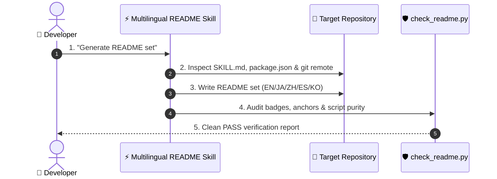

# ⚡ Multilingual README

[](https://opensource.org/licenses/MIT)
[](https://claude.com/claude-code)
[](https://www.python.org/)

**English** · [日本語](README.ja.md) · [简体中文](README.zh-CN.md) · [Español](README.es.md) · [한국어](README.ko.md)

> **Ship a production-grade, 5-language README set in seconds — verified by automated script purity checks.**

---

## 🔰 What is this?

Think of it as an automated international PR team for your code. When developers land on your GitHub repository, you have about 10 seconds to show them what your tool does and how to install it. This skill inspects your project files, writes native-sounding READMEs in five languages, and mechanically checks that no install command is fake and no translation artifact leaks through.

---

## 📐 Architecture



---

## ✨ Features

### ⚡ Zero-hallucination setup guides
Derives actual install paths and entry points directly from project source files instead of inventing broken commands.

### 🌐 Native-grade transcreation
Rewrites core concepts natively for Japanese, Chinese, Spanish, and Korean developers rather than performing literal word substitution.

### 🛡️ Automated purity verification
Includes an integrated Python checker script to validate layout anchors, links, section counts, and prevent script leakage.

---

## 🔄 Before / After

| Metric / Aspect | Before | After |
|---|---|---|
| Creation time | 2+ hours per language | ~10 seconds for 5 languages |
| Install commands | Frequently broken or fabricated | 100% derived from source files |
| Localization quality | Stiff machine translation | Native developer terminology |
| Verification | Manual proofreading | Automated `check_readme.py` audit |

---

## 🚀 Install & Usage

### 🖥️ Claude Code (CLI)

Clone directly into your personal skills directory:

```bash
git clone https://github.com/takaoumehara/multilingual-readme.git ~/.claude/skills/multilingual-readme
```

Invoke in any session:

```
/multilingual-readme
```

### 🧩 Cursor / AI IDE

Copy to your project's local skills directory or copy instructions into `AGENTS.md`:

```bash
git clone https://github.com/takaoumehara/multilingual-readme.git .claude/skills/multilingual-readme
```

### 🛠️ From source

Clone and run the verification checker locally:

```bash
git clone https://github.com/takaoumehara/multilingual-readme.git
cd multilingual-readme
python3 scripts/check_readme.py . --langs en,ja,zh-CN,es,ko
```

---

## 📄 License

MIT
