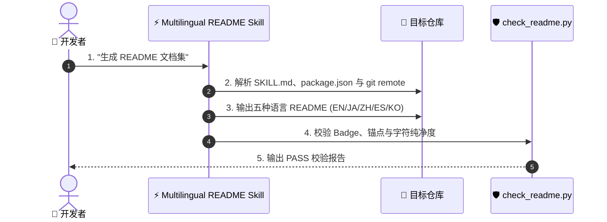

# ⚡ Multilingual README

[](https://opensource.org/licenses/MIT)
[](https://claude.com/claude-code)
[](https://www.python.org/)

[English](README.md) · [日本語](README.ja.md) · **简体中文** · [Español](README.es.md) · [한국어](README.ko.md)

> **数秒内生成高质量多语言 README 文档集 — 配套脚本自动完成纯净度校验。**

---

## 🔰 这是什么？

这相当于为你的代码配备了一个自动化的国际化宣传团队。当开发者访问你的 GitHub 仓库时，你只有大约 10 秒的时间向他们展示工具的作用及安装方法。本 Skill 会自动解析项目文件，生成符合五种语言开发者阅读习惯的 README 文档，并通过自动化脚本严格校验安装命令与文本纯净度。

---

## 📐 系统架构



---

## ✨ 三大亮点

### ⚡ 零幻觉安装指南
直接从项目源文件中提取实际安装路径与入口点，杜绝生成无法运行的虚假命令。

### 🌐 本地化专业编译
并非逐字机械翻译，而是针对中日韩英西开发者重新组织符合本地习惯的技术表达。

### 🛡️ 自动化纯净度校验
内置 Python 校验脚本，自动检查结构锚点、链接有效性、章节数量以及跨语言字符泄漏。

---

## 🔄 使用前 / 使用后

| 指标 / 维度 | 使用前 | 使用后 |
|---|---|---|
| 编写耗时 | 每种语言需 2 小时以上 | 5 种语言共约 10 秒 |
| 安装命令 | 容易出现拼写错误或虚假路径 | 100% 提取自源文件 |
| 翻译质量 | 生硬的机器翻译 | 符合本地开发者习惯的技术措辞 |
| 校验方式 | 人工逐字排查 | `check_readme.py` 自动化测试 |

---

## 🚀 安装与使用

### 🖥️ Claude Code (CLI)

克隆至个人 Skill 目录:

```bash
git clone https://github.com/takaoumehara/multilingual-readme.git ~/.claude/skills/multilingual-readme
```

在会话中调用:

```
/multilingual-readme
```

### 🧩 Cursor / AI IDE

复制至项目的本地 Skill 目录，或将指令添加至 `AGENTS.md`:

```bash
git clone https://github.com/takaoumehara/multilingual-readme.git .claude/skills/multilingual-readme
```

### 🛠️ 从源码运行

克隆仓库并运行校验脚本:

```bash
git clone https://github.com/takaoumehara/multilingual-readme.git
cd multilingual-readme
python3 scripts/check_readme.py . --langs en,ja,zh-CN,es,ko
```

---

## 📄 许可证

MIT
