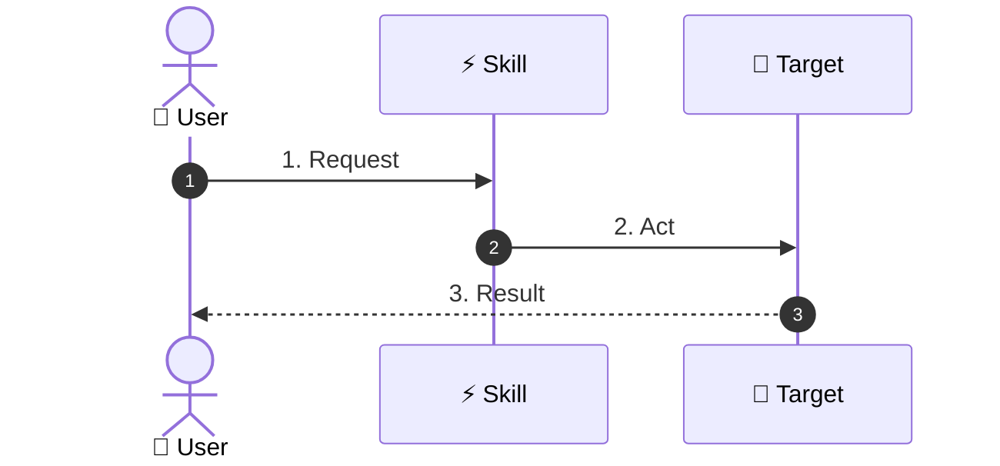
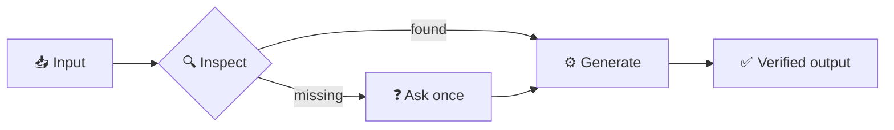
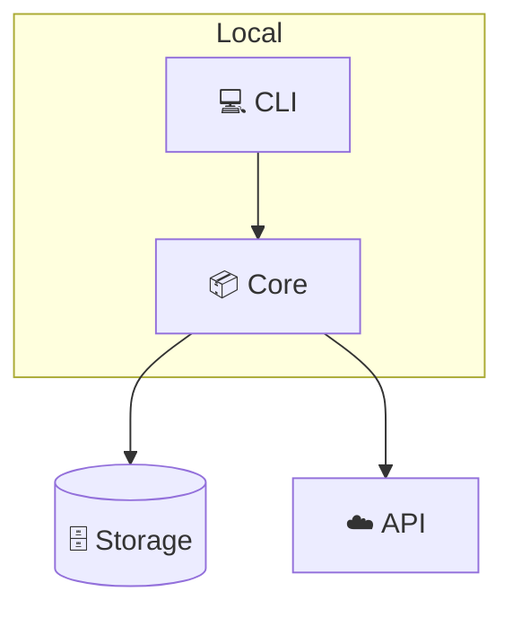

# README template

Read this when drafting. The skeleton is fixed across languages; the prose is not.

## Contents
- [Section skeleton](#section-skeleton)
- [Full example (English)](#full-example-english)
- [Localized headings](#localized-headings)
- [Badge catalog](#badge-catalog)
- [Mermaid patterns](#mermaid-patterns)

---

## Section skeleton

Order matters — it mirrors how a reader's attention decays. Emoji anchors are
identical in every language, which is what lets the checker script and a
language-switching reader both find their place.

| # | Anchor | Purpose | Length budget |
|---|---|---|---|
| 1 | `# ⚡ Name` + badges | credibility at a glance | 1 line + 2–4 badges |
| 2 | language nav | escape hatch for non-English readers | 1 line |
| 3 | `> tagline` | the value, not the mechanism | 1 sentence |
| 4 | `## 🔰 What is this?` | non-engineer explanation via analogy | 2–3 lines |
| 5 | `## 📐 Architecture` | Mermaid diagram, replaces a demo GIF | 1 diagram + 1 line |
| 6 | `## ✨ Features` | exactly 3, each with emoji + one-line why | 3 × 2 lines |
| 7 | `## 🔄 Before / After` | the pain, quantified where possible | table, 3–5 rows |
| 8 | `## 🚀 Install & Usage` | per-environment, copy-pasteable | the longest section |
| 9 | optional: FAQ / Roadmap / License | | short |

---

## Full example (English)

````markdown
# ⚡ Project Name

[](https://opensource.org/licenses/MIT)
[](https://modelcontextprotocol.io/)
[](https://claude.com/claude-code)

**English** · [日本語](README.ja.md) · [简体中文](README.zh-CN.md) · [Español](README.es.md) · [한국어](README.ko.md)

> **Ship a feature without stopping to explain your project to a new AI tool.**

---

## 🔰 What is this?

Think of it as a passport for your project. When you switch from one AI assistant to
another, you normally have to re-explain everything from scratch. This writes a short
note the next tool can read, so the work continues where it stopped.

---

## 📐 Architecture

```mermaid
sequenceDiagram
    autonumber
    actor Dev as 👤 Developer
    participant A as 🤖 Tool A
    participant Note as 📝 .handoff/
    participant B as 🤖 Tool B

    Dev->>A: 1. Finish a work session
    A->>Note: 2. Write one handoff note
    Dev->>B: 3. Open a different tool
    Note-->>B: 4. Restore context instantly
```

---

## ✨ Features

### 🔁 Works across every tool
One plain-text note, readable by any assistant — no lock-in to a single vendor.

### ⚡ One command, three seconds
No configuration files to maintain and nothing to run in the background.

### 🔒 Stays in your repo
Notes live beside your code and travel with it through git. Nothing is uploaded.

---

## 🔄 Before / After

| | Before | After |
|---|---|---|
| Switching tools | Re-explain the whole project | Read one note |
| Context setup | 10–15 minutes | ~10 seconds |
| Where context lives | In a chat log you lose | In your repository |

---

## 🚀 Install & Usage

### 🖥️ Pattern A — CLI / terminal

<!-- only the environments the project genuinely supports -->

### 🧩 Pattern B — AI-integrated IDE

### 🌐 Pattern C — Web

### 🛠️ Pattern D — From source

---

## 📄 License

MIT
````

---

## Localized headings

Use these; they are what each language's developer docs actually say. Keep the emoji.

| Anchor | English | 日本語 | 简体中文 | Español | 한국어 |
|---|---|---|---|---|---|
| 🔰 | What is this? | これは何？ | 这是什么？ | ¿Qué es esto? | 이게 뭔가요? |
| 📐 | Architecture | システム概念図 | 系统架构 | Arquitectura | 시스템 구조 |
| ✨ | Features | 3つの強み | 三大亮点 | 3 puntos clave | 3가지 강점 |
| 🔄 | Before / After | 導入前 / 導入後 | 使用前 / 使用后 | Antes / Después | 도입 전 / 도입 후 |
| 🚀 | Install & Usage | インストールと使い方 | 安装与使用 | Instalación y uso | 설치 및 사용법 |
| 📄 | License | ライセンス | 许可证 | Licencia | 라이선스 |

Sub-labels for the non-engineer section, when you want one:
EN "for non-engineers" / JA「非エンジニア向け」/ ZH「写给非技术读者」/ ES «para no técnicos» / KO「비개발자를 위한 설명」.

---

## Badge catalog

Pick 2–4. More than four reads as noise and pushes the tagline below the fold.
Only use a badge whose claim you verified — a CI badge pointing at a workflow that does
not exist is worse than no badge.

```markdown
[](https://opensource.org/licenses/MIT)
[](https://opensource.org/licenses/Apache-2.0)
[](https://modelcontextprotocol.io/)
[](https://claude.com/claude-code)
[](https://www.npmjs.com/package/PACKAGE)
[](https://nodejs.org/)
[](https://www.python.org/)
[](https://www.typescriptlang.org/)
[](CONTRIBUTING.md)
```

---

## Mermaid patterns

Translate node labels along with the prose — an English-only diagram inside a Korean
README is exactly the kind of half-localization the checker flags.

**Sequence** — best when the value is a flow over time (the default choice):



**Flowchart** — best when the value is a decision or a pipeline:



**Architecture / graph** — best when the value is how pieces connect:



Keep diagrams under ~8 nodes. A diagram that needs a legend has stopped being a
10-second explanation.
